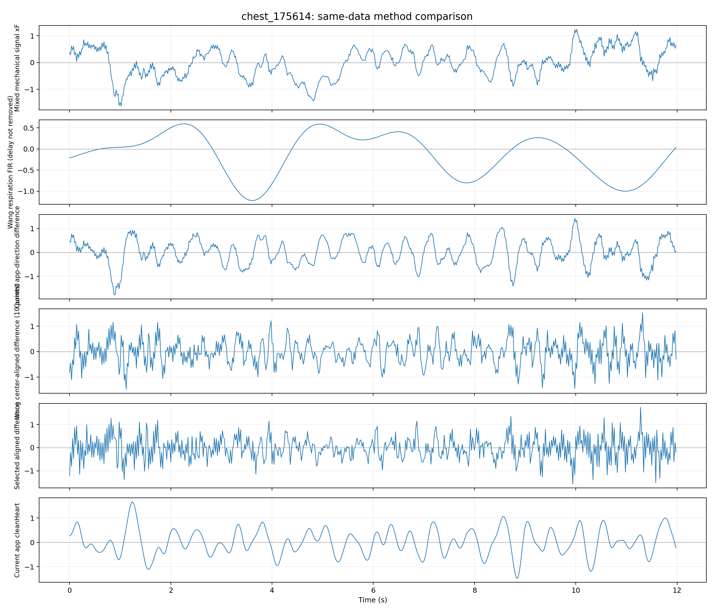
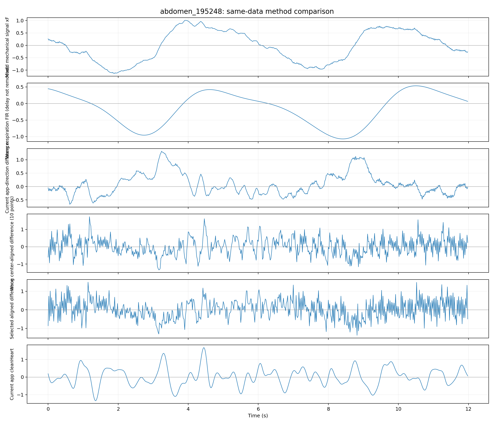
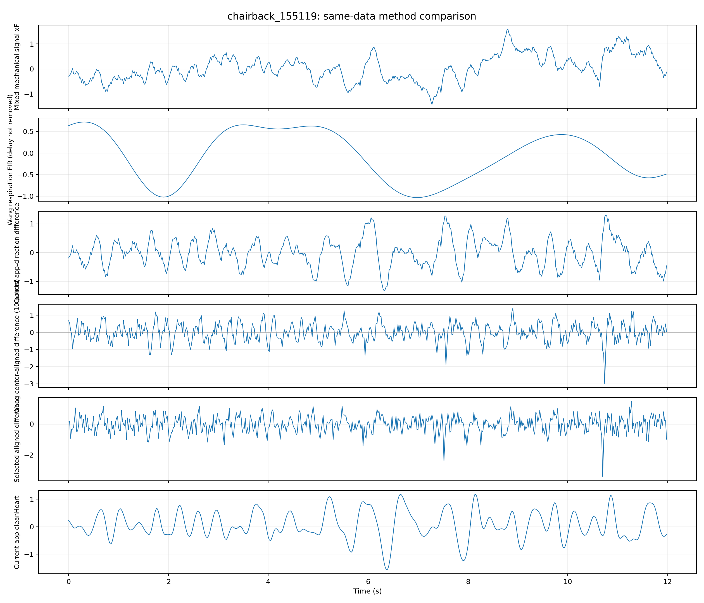

# 三篇论文方法复现结论与参数记录

日期：2026-07-15  
复现基线提交：`5d099dc 修复周期增强依赖并优化四周期显示`

## 1. 本次实际完成的工作

1. 在试验前提交并固定当前 App 版本，避免论文试验污染可工作的基线。
2. 提取并核对两篇车辆摩擦电论文和汪水相论文第三章的方法、采样率、预处理、标签与评价目标。
3. 从历史日志中固定三个人体位置：胸口、腹部、坐姿椅背；另使用三份桌面无人数据作为负对照。
4. 在相同日志上复现：
   - 当前 App 的 `cleanHeart`；
   - 当前回退版本的差分方向；
   - 汪论文 10 点移动平均、5 点中心对齐差分；
   - 汪论文窄带心搏 FIR；
   - 210 组对齐差分参数（窗口 6–20 点、中心偏移 ±2 点、无低通或 4/6/8/10/12 Hz 后置低通）。
5. 保存全部方法的派生时序 CSV、指标 CSV、参数搜索表、JSON 和 PNG/SVG 波形。

## 2. 两篇车辆论文是否采用

### 2.1 Chi 2026：不用于呼吸/心搏分离

该论文使用布置在头枕、座椅左右侧的摩擦电阵列，CNN 分类无人、急刹、左看、正常、右看等动作。70% 数据训练、30% 测试，报告的是坐姿/头动分类准确率，不是 BPM/RPM 或 SCG 分离准确率。

可借鉴：多点座椅布置、抗振动数据增强、坐姿/疲劳动作标签。  
不可直接采用：CNN 不会凭空提供当前项目缺少的心搏真值，其 98% 不能换算为心率准确率。

### 2.2 Zhang 2022/2023：不用于呼吸/心搏分离

该论文的传感器位于手部，采集非驾驶动作。原始信号 1000 Hz，经 15 Hz 低通后降采样到 60 Hz，以同步视频作为五类动作标签，再使用宽度 80、步长 1 的滑窗训练 RF/SVM/RNN/GRU/LSTM。LSTM 的 93.5% 是五类动作测试准确率。

可借鉴：同步视频标签、滑窗数据集、时序分类模型。  
不可直接采用：本项目为约 50 Hz 单通道椅背机械混合信号，目标是呼吸/心搏分离，输入位置、频率、标签和输出都不一致。

决定：**两篇方法均不接入当前 App 的生命体征通道**。若以后增加驾驶动作或坐姿识别模块，再单独建立有视频标签的数据集。

## 3. 汪论文方法如何复现

### 3.1 呼吸

- 采样率：50 Hz。
- FIR 低通：通带约 0–0.4 Hz，0.4–0.6 Hz 过渡，0.6 Hz 后强衰减；论文称 633 阶。
- 本次使用 633 个 Kaiser 窗 FIR 系数近似论文约 80 dB 阻带设计。
- 结论：在胸、腹、椅背日志上都能形成平滑的低频呼吸波形，但存在约 6.3 s 群延迟（论文文字中也出现 10–12.66 s 的口径）。当前 App 已经有同类 633 点 FIR 呼吸通道，没必要再增加一套。

### 3.2 心搏窄带 FIR

- 论文探索约 0.8–1.9/2.0 Hz 的窄带 FIR，随后明确否定其作为高保真 SCG 的方案。
- 本次结果与论文的否定理由一致：波形变得平滑、周期模板一致性有时较高，但 4 Hz 以上细节基本为 0，主周期也偏离日志内部 BPM 参考。
- 因此它可以制造“更像规则单峰”的图，却不适合宣称保留 AO/IC/AC 等 SCG 机械细节。

### 3.3 10 点移动平均中心对齐差分

论文正确时序应为：10 点因果移动平均的结果对应窗口中心附近，故将原始信号延迟约 5 点，再用“延迟原始信号 − 当前移动平均”完成中心对齐。当前回退版本的 `DifferentialHeartSeparator` 是“当前原始信号 − 再延迟 5 点的移动平均”，方向不等价；但它目前只是旧诊断链路，正式 BPM 使用 `cleanHeart`，所以本轮没有直接修改 App。

## 4. 数据与评价基准

| 数据 | 放置 | 用途 | 日志内部 BPM 中位数 |
|---|---|---|---:|
| chest_175614 | 胸前双手固定 | 人体主数据 | 76.2 |
| abdomen_195248 | 腹部 | 人体主数据 | 70.7 |
| chairback_155119 | 坐姿椅背 | 人体主数据 | 75.8 |
| desk_195115 | 桌面无人 | 负对照 | 不作为参考 |
| desk_203107 | 桌面无人 | 负对照 | 不作为参考 |
| desk_203202 | 桌面无人 | 负对照 | 不作为参考 |

历史数据没有同步 ECG/PPG，因此日志 BPM 仅作为内部参考，不是医学真值。盲评指标包括自相关周期、呼吸残留、同步周期模板一致性、RR 变异、高频细节和噪声；内部参考只用于阻止算法误选明显的呼吸谐波。

## 5. 关键结果

### 5.1 汪论文原始 10 点/5 点差分

| 位置 | 自相关主周期 | 内部参考 | 周期性 | 模板一致性 | 呼吸残留 | 4–10 Hz 细节 |
|---|---:|---:|---:|---:|---:|---:|
| 胸口 | 78.9 BPM | 76.2 | 0.45 | 0.19 | 0.4% | 46.7% |
| 腹部 | 88.2 BPM | 70.7 | 0.62 | 0.10 | 16.7% | 32.6% |
| 椅背 | 48.4 BPM | 75.8 | 0.51 | 0.17 | 1.6% | 43.8% |

解释：中心对齐差分确实显著削弱了低频呼吸，但同时放大快速变化和噪声。它在胸口能找到接近内部参考的周期，却不能跨腹部和椅背保持同一逻辑；周期模板一致性仅 0.10–0.19，也没有形成论文中清晰重复的 SCG 峰群。

### 5.2 参数搜索

综合评分最高的是 `MA=6 点、原始信号延迟=3 点、无后置低通`。它只是搜索空间中的“最高分”，**未达到采用条件**：

- 胸/腹/椅背主周期分别约 78.9、100.0、48.4 BPM，未跨位置一致；
- 人体数据模板一致性仅约 0.09–0.15；
- 高频噪声约 15.9%、23.3%、22.4%；
- 三份桌面无人数据也出现约 100、75、46.9 BPM 的强伪周期；其中两份桌面的周期性达到 0.74 和 0.90，反而高于多数人体数据；
- 桌面无人高频噪声达到约 46%–73.5%。

因此不能因为胸口某一段图形更尖、更周期化就替换正式通道。

### 5.3 当前 `cleanHeart`

当前 `cleanHeart` 在三个人体位置的呼吸残留约 0.7%、4.3%、1.6%，低频抑制明显优于旧差分在腹部的 76.3% 残留。它的缺点是 4 Hz 以上细节只剩约 0.4%–0.7%，所以更适合称为“心率检测波形”，不能称为高保真 SCG。

此外，桌面无人数据的 `cleanHeart` 也可能有规则伪周期；日志中的 `presenceState` 已将 desk_203107 和 desk_203202 全部标为 `ABSENT`，说明必须联合在位判断，不能只看波形周期就认定存在心搏。当前 PresenceObserver 仍是观察通道，不参与正式 BPM 门控，这是后续产品化时要单独处理的问题。

## 6. 最终采用决定

| 方法 | 呼吸提取 | BPM 检测 | 高保真 SCG | 是否接入 App |
|---|---|---|---|---|
| Chi CNN 坐姿分类 | 不适用 | 不适用 | 不适用 | 否 |
| Zhang LSTM 动作分类 | 不适用 | 不适用 | 不适用 | 否 |
| 汪呼吸 FIR | 可用，App 已有同类实现 | RPM 仍需现有寻峰/门控 | 不涉及 | 不重复接入 |
| 汪窄带心搏 FIR | 呼吸残留低 | 主周期跨位置不可靠 | 会抹掉细节 | 否 |
| 汪 10/5 对齐差分 | 胸/椅背呼吸残留低，腹部仍受影响 | 仅胸口接近内部参考 | 当前传感器上噪声占主导 | 否 |
| 搜索最优 6/3 差分 | 低频抑制更强 | 人/无人都产生强周期 | 模板一致性低 | 否 |
| 当前 cleanHeart | 呼吸残留总体较低 | 保留为当前基线 | 不是高保真 SCG | 保留 |

结论：**不采用两篇车辆论文的方法；汪论文呼吸方法与 App 已有实现一致，心搏差分方法在当前历史数据上复现失败，不替换当前基线。** 失败原因已通过胸、腹、椅背和三份桌面负对照保留，不是主观以“好不好看”判断。

## 7. 为什么汪论文能得到规则心搏，而本项目不能直接复现

1. 论文使用其自制高灵敏驻极体压力传感器和匹配的模拟前端；本项目传感器频响、噪声和机械耦合不同。
2. 论文主要为卧姿睡眠耦合，本项目重点是坐姿椅背，压力路径、接触面积和椅背结构都会改变 BCG/SCG 传递函数。
3. 论文用同步 ECG 验证 AO 周期；本项目历史日志没有独立心搏真值，无法确认尖峰到底是 AO、体动还是结构噪声。
4. 本项目 `xF` 在记录前已经过前置移动平均与低通，原始快速机械细节有一部分不可逆地丢失；后处理不能把已丢失的 SCG 峰群恢复出来。
5. 差分本质上是高频增强。在论文信噪比较高时它突出心搏；在当前数据中也会同样突出 ADC 抖动、摩擦、电缆和椅背微振动。

## 8. 若后续必须获得 SCG，应如何继续

下一步不应继续只调滤波参数，而应做一次带同步参考的采集：固定传感器位置和预压力，同时记录指夹 PPG 或 ECG；至少采集胸口与坐姿椅背各 3–5 分钟，并另采无人、正常呼吸和轻微体动段。只有这样才能以参考 R 峰/脉搏峰评价每次机械心搏是否真实对应，而不是用待验证的 App BPM 反过来证明算法正确。

在没有同步参考前，可以交付“呼吸波形、当前心率检测波形、周期增强展示波形”，但论文中必须分别标注：周期增强波形是同步平均后的展示信号，`cleanHeart` 是心率检测通道，均不宣称为带 AO/IC/AC 标注的高保真 SCG。

## 9. 结果文件

- `results/method_metrics.csv`：每个数据、每种方法的全部指标。
- `results/wang_parameter_search.csv`：210 组参数与综合评分。
- `results/reproduction_results.json`：完整结构化结果和前十候选。
- `results/derived_signals/*.csv`：每条日志的完整派生时序，可直接导入 Origin。
- `results/*_method_overview.png/svg`：同一数据、同一时间段的六通道对比。
- `results/*_templates.png/svg`：心搏同步代表周期；明确不是原始连续波形。

代表图：

