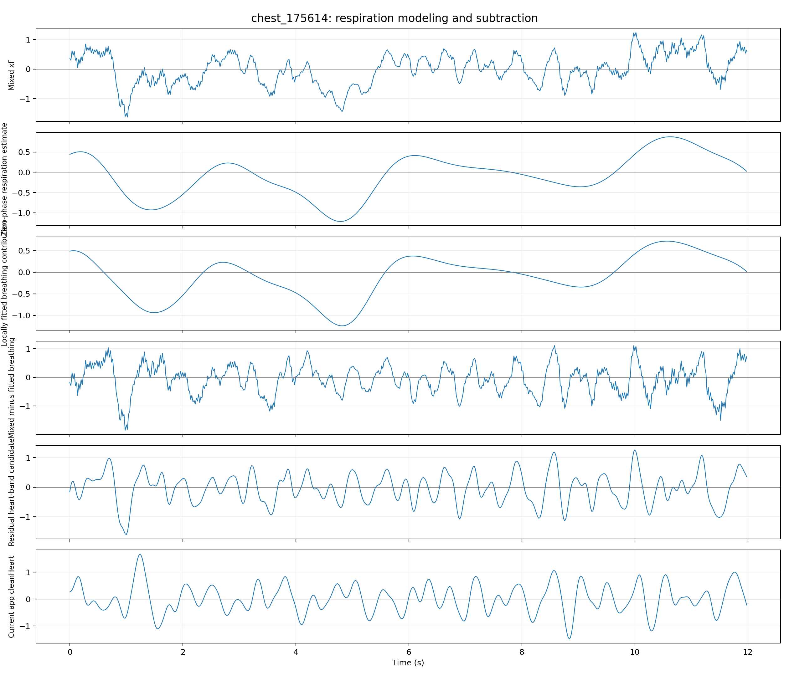
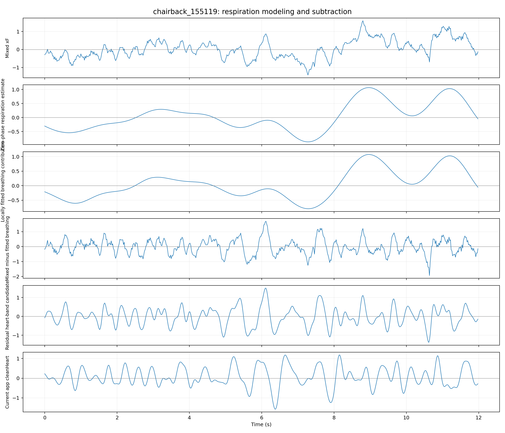
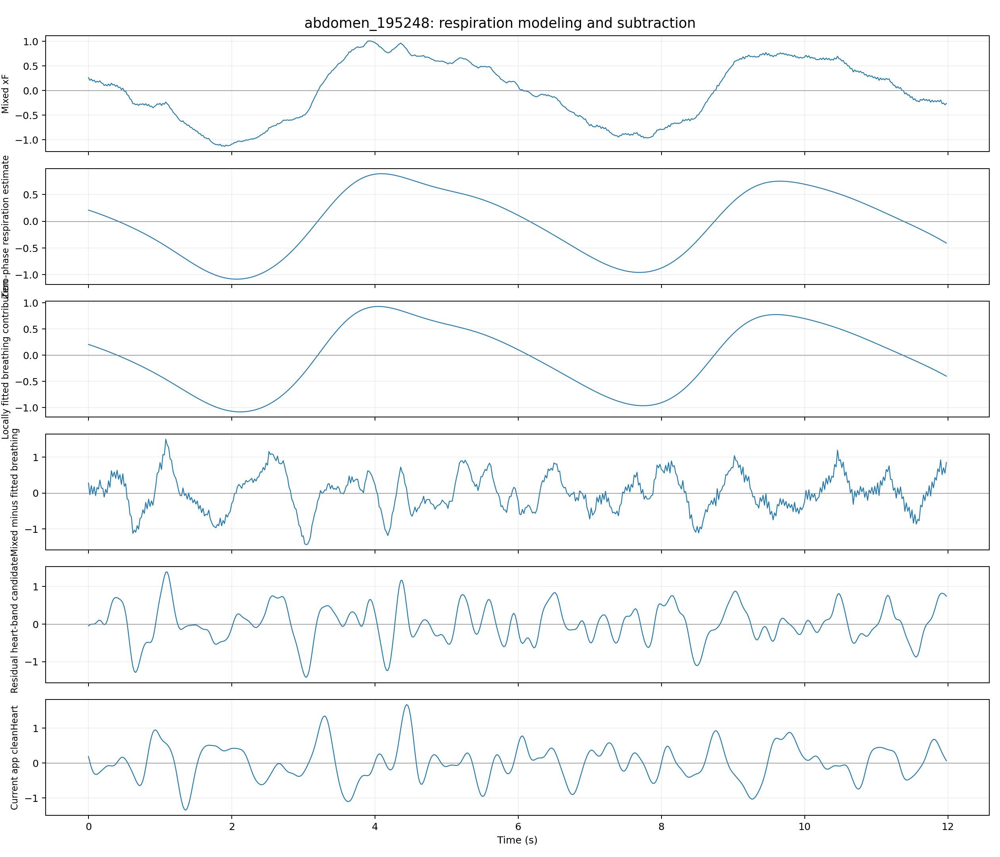

# 呼吸建模相减实验

日期：2026-07-15  
状态：仅离线研究，未修改 App 正式通道

## 1. 这次所说的“基线”有两种

### 1.1 App 信号处理基线

当前心搏显示/正式 BPM 的基础波形为日志中的 `cleanHeart`：

1. `xF` 依次经过两级 0.8 Hz 二阶高通；
2. 再经过两级 4 Hz 二阶低通；
3. 最后经过 3 点移动平均。

因此综合上相当于较陡的约 0.8–4 Hz 心率检测通道。正式 BPM 不是简单数波峰，而是组合 `cleanHeart` 分组峰检测和周期性估计。

该基线的优点是呼吸残留低、波形平滑；缺点是压制 4 Hz 以上机械细节，所以不能称为高保真 SCG。

### 1.2 本次 A/B 评价基线

- 胸口、腹部、椅背日志内正式 BPM 中位数分别为 76.2、70.7、75.8 BPM，仅作为内部比较参考。
- 同时计算不依赖 BPM 标签的自相关周期性、同步周期模板一致性、RR 变异、呼吸残留和高频细节。
- 使用三份桌面无人数据检查伪周期。

这个基线适合回答“新方法是否比当前 App 更自洽”，但不等于医学真值。由于没有同步 ECG/PPG，它不够资格证明 BPM 准确或某个峰就是 AO 峰。

## 2. 本轮提出的方法

把混合信号写成：

`mixed(t) = breathing_contribution(t) + heart(t) + motion/noise(t)`

不是直接用相同幅值硬减，而是：

1. 对 `xF` 做零相位低通，先提取呼吸参考波形；
2. 在局部时间窗内，用呼吸、呼吸一阶变化、呼吸平方项和交互项拟合呼吸对混合信号的实际贡献；
3. 用 `xF - fitted_breathing` 得到残差；
4. 对残差使用较宽的心搏带通，避免像当前 4 Hz 低通一样完全抹掉机械细节；
5. 在胸口、腹部、椅背和三份桌面无人数据上统一评价。

搜索范围：

- 呼吸低通截止：0.35、0.4、0.5、0.6 Hz；
- 局部回归窗口：8、12、20、30 s；
- 线性/非线性呼吸基函数；
- 心搏高通：0.6、0.7、0.8 Hz；
- 心搏低通：4、6、8、10 Hz；
- 共 384 组参数。

## 3. 搜索结果

最高综合评分参数为：

- 呼吸参考截止：0.6 Hz；
- 12 s 局部非线性回归；
- 残差心搏带通：0.8–6 Hz。

但 `acceptedCandidateCount = 0`，也就是 384 组中没有一组同时满足：

1. 三个人体位置的主周期相对内部参考误差不超过 15%；
2. 三个位置模板一致性不低于 0.35；
3. 桌面无人周期性低于全部人体数据。

## 4. 与当前 cleanHeart 的结果比较

| 位置 | 方法 | 自相关主周期 | 内部参考 | 周期性 | 模板一致性 | 呼吸残留 | 4–10 Hz 细节 |
|---|---|---:|---:|---:|---:|---:|---:|
| 胸口 | 当前 cleanHeart | 71.4 | 76.2 | 0.15 | 0.39 | 0.7% | 0.7% |
| 胸口 | 呼吸回归相减 | 73.2 | 76.2 | 0.19 | 0.43 | 0.0% | 4.0% |
| 腹部 | 当前 cleanHeart | 50.0 | 70.7 | 0.20 | 0.53 | 4.3% | 0.4% |
| 腹部 | 呼吸回归相减 | 53.6 | 70.7 | 0.16 | 0.46 | 0.1% | 2.5% |
| 椅背 | 当前 cleanHeart | 50.8 | 75.8 | 0.12 | 0.35 | 1.6% | 0.6% |
| 椅背 | 呼吸回归相减 | 75.0 | 75.8 | 0.16 | 0.45 | 0.1% | 3.3% |

改进点：

- 胸口主周期从 71.4 调整到 73.2 BPM，更接近内部参考 76.2；
- 椅背从错误的约 50.8 BPM 调整到 75.0 BPM，接近内部参考 75.8；
- 三个位置呼吸残留降到约 0.0%–0.1%；
- 保留的 4–10 Hz 细节提高到约 2.5%–4.0%。

未解决点：

- 腹部仍只得到约 53.6 BPM，未恢复 70.7 BPM 周期；
- 连续心搏候选仍是多峰且幅度变化明显，没有形成论文图中稳定重复的单一机械心搏形态；
- 桌面无人数据周期性仍达到约 0.24、0.43、0.37，第二份桌面数据的伪周期甚至高于人体胸口和椅背；
- 因此“减掉呼吸”只能清除低频背景，不能自动证明剩下的就是心搏。

## 5. 是否能得到论文那样周期明显、波形好看的心跳

结论分两种情况：

### 连续真实提取波形

目前不能。呼吸相减确实让胸口和椅背的 BPM 周期更接近内部参考，但残差里仍混有结构振动、ADC 抖动和接触变化。腹部失败及桌面伪周期证明，不能把这条连续残差直接当成可靠心搏。

### 论文展示用周期增强波形

可以用真实检测到的心搏中心做同步分段、归一化、叠加平均，再连续显示约 4 个周期。这会让周期形态明显，但必须标注为“心搏同步叠加平均/周期增强展示信号（非原始连续波形）”。不能通过按指定 BPM 人工复制模板得到波形，也不能将增强图当作 SCG 原始提取证据。

## 6. 本轮决定

- 不替换当前正式 `cleanHeart`。
- 保留“0.6 Hz 呼吸建模 + 12 s 非线性局部回归 + 0.8–6 Hz 残差带通”为候选 B 通道，因为它明显改善了坐姿椅背主周期。
- 在没有同步 PPG/ECG 的情况下，不将该候选接入正式 BPM。
- 后续若只做论文展示，可从候选 B 通道生成明确标注的周期增强图；若要证明真实 SCG，则必须同步采集心搏参考。

## 7. 已保存内容

- `respiration_cancellation_parameter_search.csv`：384 组完整参数与结果；
- `respiration_cancellation_metrics.csv`：当前基线、直接相减和局部回归相减指标；
- `respiration_cancellation_results.json`：完整结构化结果；
- `derived_signals/*.csv`：每份日志全部派生时序，可直接导入 Origin；
- `*_respiration_subtraction.png/svg`：混合信号、呼吸估计、拟合呼吸、相减残差、候选心搏和当前 cleanHeart 对比；
- `*_four_cycle_zoom.png/svg`：胸口、腹部、椅背最优四周期观察窗口。

